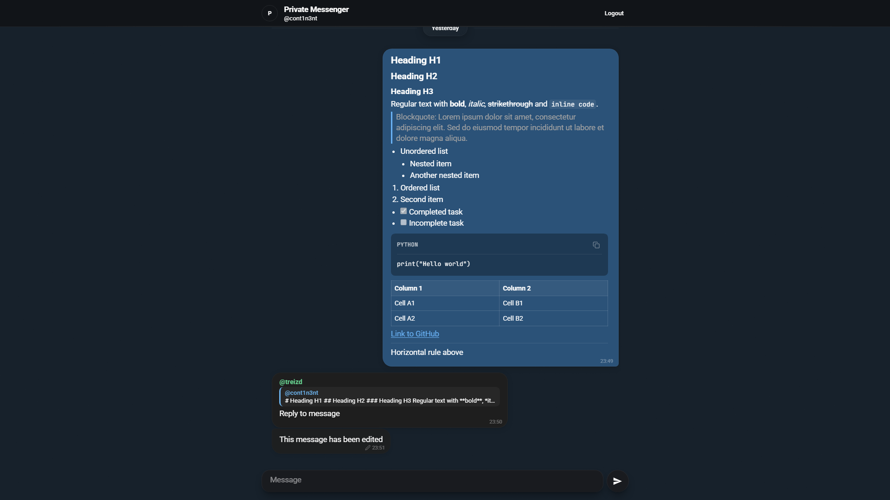

# Private Messenger


## Preview



Real-time group chat with end-to-end encryption. Messages are encrypted in the browser before being sent to the backend, and the backend stores ciphertext instead of plaintext.

## Status

This project is an actively maintained portfolio MVP.
It is suitable for demos, learning, code review, and further development, but it is not positioned as a production-hardened messenger yet.

## Features

- Ed25519 challenge-response authentication
- X25519 ECDH plus HKDF for pairwise shared secrets
- XChaCha20-Poly1305 encryption for messages
- Founder-generated group key distributed through pairwise encrypted messages
- Real-time updates over WebSocket with reconnect logic
- Markdown message rendering
- Message editing, deleting, and expiry
- Async FastAPI backend with SQLite and SQLAlchemy

## Architecture


## Tech Stack

| Layer | Technology |
|---|---|
| Backend | Python 3.12, FastAPI, SQLAlchemy 2.0, aiosqlite |
| Frontend | React 19, TypeScript 6, Vite 8, Tailwind CSS 4 |
| Cryptography | `@noble/curves`, `@noble/ciphers` |
| Real-time | FastAPI WebSocket |
| Runtime | Docker Compose, nginx |
| Animations | Framer Motion 12 |
| Testing | pytest, pytest-asyncio, httpx |

## Cryptography

| Purpose | Algorithm |
|---|---|
| Authentication | Ed25519 challenge-response |
| Key exchange | X25519 ECDH + HKDF-SHA256 |
| Message encryption | XChaCha20-Poly1305 AEAD |
| Group key | Random 32-byte key distributed via pairwise ECDH |
| Client key storage | IndexedDB |

## Getting Started

### Prerequisites

- Docker Desktop with Docker Compose

### Clone repo
  
```bash
git clone https://github.com/cont1n3nt/private-messenger.git

cd private-messenger
```


### Run With Docker

```bash
docker compose up --build
```

Open `http://localhost:8080` and log in with one of the demo usernames: `cont1n3nt`, `ayala13rus`, or `treizd`.

The backend initializes the SQLite database and demo users on startup. Local runtime data is stored outside the containers:

- Database: `backend/data/private_messenger.db`
- Demo key exports: `backend/keys/<username>.json`

### Stop Containers

```bash
docker compose down
```

### Reset Local Demo Data

PowerShell:

```powershell
Remove-Item -Recurse -Force backend\data, backend\keys -ErrorAction SilentlyContinue
docker compose up --build
```

### Development Checks

These optional checks are for local development environments with Python 3.12+, Node.js 20+, and installed dependencies.

Backend tests:

```bash
cd backend
pytest
```

Frontend checks:

```bash
cd frontend
npm run lint
npm run build
```

## CI

GitHub Actions runs the project checks automatically on pull requests and pushes to `main`:

- Backend tests with Python 3.12 and `pytest`
- Frontend clean install, lint, and production build with Node.js 22
- Docker Compose config validation and image build

## API Overview

All endpoints live under `/api/v0`.

| Method | Path | Description |
|---|---|---|
| POST | `/auth/challenge` | Request a challenge |
| POST | `/auth/verify` | Verify an Ed25519 signature |
| GET | `/auth/me` | Get current user info |
| POST | `/keys/init` | Upload public keys |
| GET | `/keys` | Get all public keys |
| GET | `/messages` | Get paginated messages |
| POST | `/messages` | Send an encrypted message |
| POST | `/messages/edit` | Edit your own message |
| POST | `/messages/delete` | Delete your own message |
| WS | `/ws` | Real-time WebSocket |

## Project Structure

```text
backend/
|-- app/
|   |-- main.py
|   |-- api/v0/
|   |-- db/
|   `-- schemas/
|-- Dockerfile
|-- docker-entrypoint.sh
|-- requirements.txt
`-- seed.py

frontend/
|-- src/
|   |-- api/
|   |-- components/
|   |-- crypto/
|   |-- hooks/
|   |-- pages/
|   |-- store/
|   `-- theme/
|-- Dockerfile
|-- nginx.conf
|-- index.html
|-- package.json
`-- vite.config.ts
```

## License

MIT
