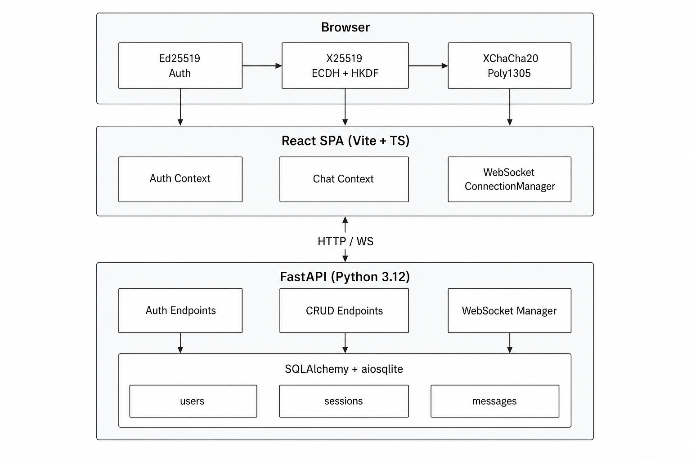

# Private Messenger


---

Real-time group chat with **end-to-end encryption**. Messages are encrypted in the browser before leaving the client — the server never sees plaintext.

## Features

- **Ed25519 challenge-response** authentication — no passwords
- **X25519 ECDH + HKDF** for pairwise shared secrets
- **XChaCha20-Poly1305 AEAD** encryption for every message
- **Group key** distribution — founder generates a random key, distributes it encrypted via pairwise ECDH
- **WebSocket** real-time messaging with automatic reconnection & exponential backoff
- **Markdown** rendering in messages (GFM)
- **Message expiry** (48-hour TTL), edit & delete
- **Rate limiting** on auth & send endpoints
- **UI** minimal dark UI with animated interactions
- **SQLite** persistence with async SQLAlchemy

## Architecture



## Tech Stack

| Layer | Technology |
|---|---|
| Backend | Python 3.12, FastAPI, SQLAlchemy 2.0, aiosqlite |
| Frontend | React 19, TypeScript 6, Vite 8, Tailwind CSS 4 |
| Cryptography | @noble/curves (Ed25519, X25519), @noble/ciphers (XChaCha20-Poly1305) |
| Real-time | WebSocket (FastAPI native) |
| Animations | Framer Motion 12 |
| Testing | pytest, pytest-asyncio, httpx |
| Container | Docker |

## Cryptography

| Purpose | Algorithm |
|---|---|
| Authentication | Ed25519 challenge-response |
| Key exchange | X25519 ECDH + HKDF-SHA256 |
| Message encryption | XChaCha20-Poly1305 AEAD |
| Group key | Random 32-byte key, distributed via pairwise ECDH |
| Client key storage | IndexedDB |

## Getting Started

### Prerequisites

- Python 3.12+
- Node.js 20+
- npm

### Backend

```bash
cd backend
python -m venv .venv
.venv\Scripts\activate    # Windows
pip install -r requirements.txt
python seed.py            # create demo users
uvicorn app.main:app --reload
```

### Frontend

```bash
cd frontend
npm install
npm run dev
```

Open `http://localhost:5173` and log in with one of the demo usernames (`kosmo`, `ayala13rus`, `treizd`).

### Run tests

```bash
cd backend
pytest        # discovers api/test/ and db/tests/
```

## API Overview

All endpoints live under `/api/v0`:

| Method | Path | Description |
|---|---|---|
| POST | `/auth/challenge` | Get a challenge |
| POST | `/auth/verify` | Verify Ed25519 signature |
| GET | `/auth/me` | Current user info |
| POST | `/keys/init` | Upload public keys |
| GET | `/keys` | All public keys |
| GET | `/messages` | Paginated messages |
| POST | `/messages` | Send encrypted message |
| POST | `/messages/edit` | Edit own message |
| POST | `/messages/delete` | Delete own message |
| WS | `/ws` | Real-time WebSocket |

## Project Structure

```
backend/
├── app/
│   ├── main.py              # FastAPI entry point
│   ├── api/v0/              # REST + WS endpoints
│   ├── db/                  # SQLAlchemy models + CRUD
│   └── schemas/             # Pydantic schemas
├── requirements.txt
└── seed.py                  # Demo data generator

frontend/
├── src/
│   ├── api/                 # Axios API client
│   ├── crypto/              # Auth, ECDH, cipher, key storage
│   ├── store/               # React Context (Auth + Chat)
│   ├── pages/               # Login, Chat
│   ├── components/          # UI components
│   ├── hooks/               # Custom hooks
│   └── theme/               # Colors, glass, typography
├── index.html
├── vite.config.ts
└── package.json
```

## License

MIT
